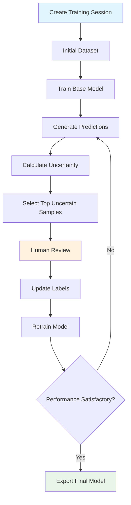

# 🧠 Active Learning System

## Overview

The Active Learning system is the **game-changing feature** that makes Auto-Labeling-Tool superior to commercial solutions like Roboflow. It intelligently selects the most valuable samples for labeling, dramatically reducing the amount of manual work needed while maximizing model performance.

## 🎯 Key Features

### 1. **Intelligent Sample Selection**
- **Uncertainty Sampling**: Identifies images where the model is least confident
- **Entropy-based Selection**: Finds samples with highest prediction uncertainty
- **Confidence Variance**: Detects inconsistent predictions across object instances
- **Combined Scoring**: Multi-metric approach for optimal sample selection

### 2. **Iterative Training Pipeline**
- **Automated Training**: YOLO model training with custom datasets
- **Progressive Improvement**: Each iteration builds on previous results
- **Performance Tracking**: Comprehensive metrics (mAP50, mAP95, Precision, Recall)
- **Model Versioning**: Track and compare different model versions

### 3. **Human-in-the-Loop Interface**
- **Smart Review System**: Focus on high-uncertainty samples first
- **Quick Actions**: Accept, correct, or reject predictions with one click
- **Visual Feedback**: Uncertainty scores and confidence ranges
- **Progress Tracking**: See how your reviews improve the model

### 4. **Production-Ready Models**
- **Export Functionality**: Get trained models ready for deployment
- **Performance Metrics**: Detailed accuracy and speed benchmarks
- **Model Optimization**: CPU/GPU compatible YOLO models
- **Easy Integration**: Drop-in replacement for existing workflows

## 🚀 Getting Started

### 1. Create a Training Session

```bash
# Navigate to Active Learning dashboard
http://localhost:3000/active-learning

# Click "New Training Session"
# Configure your training parameters:
- Session Name: "Industrial Defect Detection v1"
- Dataset: Select your labeled dataset
- Epochs: 50 (recommended)
- Batch Size: 16 (adjust based on GPU memory)
- Learning Rate: 0.001 (default works well)
- Max Iterations: 10 (stop after 10 cycles)
```

### 2. Start First Iteration

```bash
# Click "Start First Iteration"
# The system will:
1. Prepare training dataset (80/20 train/val split)
2. Train YOLO model on labeled data
3. Generate uncertainty scores for unlabeled images
4. Present top uncertain samples for review
```

### 3. Review Uncertain Samples

```bash
# For each uncertain sample:
✅ Accept Prediction - Model is correct
✏️ Accept with Corrections - Mostly correct, minor fixes needed
❌ Reject Prediction - Model is wrong

# Focus on highest uncertainty scores first
# Your reviews directly improve the next iteration
```

### 4. Continue Iterations

```bash
# After reviewing samples:
1. Click "Start Next Iteration"
2. Model retrains with your feedback
3. Performance typically improves each cycle
4. Stop when satisfied with accuracy
```

### 5. Export Trained Model

```bash
# When training is complete:
1. Click "Export Best Model"
2. Get model path and performance metrics
3. Use in production auto-labeling
```

## 📊 Performance Metrics

### Model Accuracy
- **mAP50**: Mean Average Precision at IoU 0.5
- **mAP95**: Mean Average Precision at IoU 0.5-0.95
- **Precision**: True Positives / (True Positives + False Positives)
- **Recall**: True Positives / (True Positives + False Negatives)

### Uncertainty Metrics
- **Uncertainty Score**: 1 - max_confidence (higher = more uncertain)
- **Confidence Variance**: Spread of confidence scores
- **Entropy Score**: Information theory measure of uncertainty
- **Combined Score**: Weighted average of all uncertainty metrics

## 🔧 Technical Architecture

### Backend Components

```python
# Core Active Learning Pipeline
backend/core/active_learning.py
- ActiveLearningPipeline: Main orchestration class
- Training management and iteration control
- Uncertainty calculation and sample selection
- Model versioning and export functionality

# Database Models
backend/models/training.py
- TrainingSession: Session configuration and status
- TrainingIteration: Individual training cycles
- UncertainSample: High-uncertainty images for review
- ModelVersion: Trained model tracking

# API Endpoints
backend/api/active_learning.py
- Session management (CRUD operations)
- Training iteration control
- Uncertain sample review
- Progress tracking and metrics
```

### Frontend Components

```javascript
// Main Dashboard
frontend/src/components/ActiveLearning/ActiveLearningDashboard.jsx
- Session overview and management
- Real-time training progress
- Interactive sample review interface
- Performance visualization charts
```

### Database Schema

```sql
-- Training Sessions
training_sessions:
  - id, name, description, dataset_id
  - epochs, batch_size, learning_rate, max_iterations
  - status, current_iteration, best_map50, best_map95
  - created_at, started_at, completed_at

-- Training Iterations
training_iterations:
  - id, session_id, iteration_number
  - training_images_count, validation_images_count
  - map50, map95, precision, recall, loss
  - model_path, weights_path, status
  - training_time_seconds

-- Uncertain Samples
uncertain_samples:
  - id, iteration_id, image_id
  - uncertainty_score, confidence_variance, entropy_score
  - predicted_boxes, max_confidence, min_confidence
  - reviewed, accepted, corrected

-- Model Versions
model_versions:
  - id, session_id, iteration_id, version_number
  - model_path, weights_path, performance_metrics
  - is_active, is_best, model_size_mb
```

## 🎯 Use Cases

### 1. **Industrial Quality Control**
```bash
Problem: Detecting defects in manufactured parts
Solution: Start with 100 labeled defect images
Process: Active learning finds edge cases and rare defects
Result: 95%+ accuracy with minimal manual labeling
```

### 2. **Medical Image Analysis**
```bash
Problem: Identifying anomalies in medical scans
Solution: Begin with expert-labeled examples
Process: System finds diagnostically challenging cases
Result: Robust model that handles edge cases
```

### 3. **Custom Object Detection**
```bash
Problem: Detecting company-specific objects
Solution: Label initial dataset of target objects
Process: Active learning improves on difficult angles/lighting
Result: Production-ready custom detector
```

### 4. **Security and Surveillance**
```bash
Problem: Detecting suspicious activities or objects
Solution: Start with basic security footage labels
Process: System learns to handle various scenarios
Result: Reliable security detection system
```

## 📈 Performance Benefits

### Labeling Efficiency
- **50-80% reduction** in manual labeling effort
- **Focus on valuable samples** instead of random selection
- **Faster convergence** to high-accuracy models
- **Better edge case handling** through uncertainty sampling

### Model Quality
- **Higher accuracy** with same amount of labeled data
- **More robust models** that handle difficult cases
- **Reduced overfitting** through diverse sample selection
- **Better generalization** to new data

### Time Savings
- **Automated training pipeline** reduces manual work
- **Intelligent sample selection** maximizes labeling impact
- **Iterative improvement** shows progress clearly
- **Production-ready export** streamlines deployment

## 🔄 Active Learning Workflow



## 🛠️ Configuration Options

### Training Parameters
```python
# Session Configuration
{
    "name": "Custom Detection v1",
    "description": "Detecting custom objects in industrial setting",
    "dataset_id": 123,
    "epochs": 50,           # Training epochs per iteration
    "batch_size": 16,       # Images per batch
    "learning_rate": 0.001, # Learning rate
    "max_iterations": 10    # Maximum AL iterations
}
```

### Uncertainty Thresholds
```python
# Sample Selection Criteria
{
    "min_uncertainty": 0.3,     # Minimum uncertainty score
    "max_samples_per_iteration": 20,  # Samples to review
    "uncertainty_weights": {
        "confidence": 0.4,      # Weight for confidence-based uncertainty
        "entropy": 0.3,         # Weight for entropy-based uncertainty
        "variance": 0.3         # Weight for variance-based uncertainty
    }
}
```

## 🚀 Advanced Features

### 1. **Multi-Class Optimization**
- Balances uncertain samples across all classes
- Prevents bias toward majority classes
- Ensures comprehensive model coverage

### 2. **Batch Selection Strategies**
- **Diversity Sampling**: Selects diverse uncertain samples
- **Cluster-based Selection**: Avoids redundant similar images
- **Stratified Sampling**: Maintains class distribution

### 3. **Performance Monitoring**
- Real-time training metrics
- Convergence detection
- Early stopping when performance plateaus
- Automated hyperparameter suggestions

### 4. **Integration Ready**
- REST API for programmatic access
- Model export in multiple formats
- Batch processing capabilities
- Production deployment guides

## 🎉 Why This Makes Us Unbeatable

### vs. Roboflow
- ✅ **Fully Local**: No data leaves your infrastructure
- ✅ **Active Learning**: Intelligent sample selection (they don't have this)
- ✅ **Custom Training**: Full YOLO training pipeline
- ✅ **No Usage Limits**: Train as much as you want
- ✅ **Open Source**: Customize and extend freely

### vs. Labelbox
- ✅ **Integrated Training**: No need for separate ML platforms
- ✅ **Uncertainty-based Labeling**: Focus on what matters most
- ✅ **Real-time Feedback**: See model improvement immediately
- ✅ **Cost Effective**: No per-image or per-user pricing

### vs. Scale AI
- ✅ **In-house Control**: No external labeling services needed
- ✅ **Domain Expertise**: You know your data best
- ✅ **Iterative Improvement**: Continuous model enhancement
- ✅ **IP Protection**: Your models and data stay private

## 🔮 Future Enhancements

### Planned Features
- **Multi-GPU Training**: Faster training on multiple GPUs
- **Advanced Architectures**: Support for YOLOv9, YOLOv10
- **Federated Learning**: Collaborative training across sites
- **AutoML Integration**: Automated hyperparameter optimization
- **Real-time Inference**: Live uncertainty calculation
- **Advanced Visualizations**: 3D uncertainty landscapes

### Community Contributions
- **Custom Uncertainty Metrics**: Plugin system for new algorithms
- **Domain-Specific Modules**: Pre-built configurations for industries
- **Integration Connectors**: Links to popular ML platforms
- **Performance Benchmarks**: Standardized evaluation datasets

---

## 🎯 **Ready to Revolutionize Your Labeling Workflow?**

The Active Learning system transforms tedious manual labeling into an intelligent, efficient process. Start with a small labeled dataset and watch as the system guides you to create production-ready models with minimal effort.

**Get started today and experience the future of computer vision labeling!** 🚀